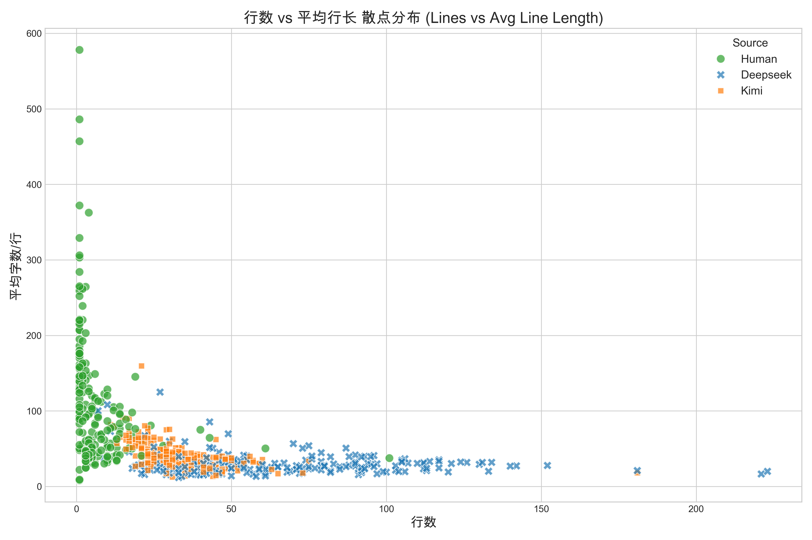
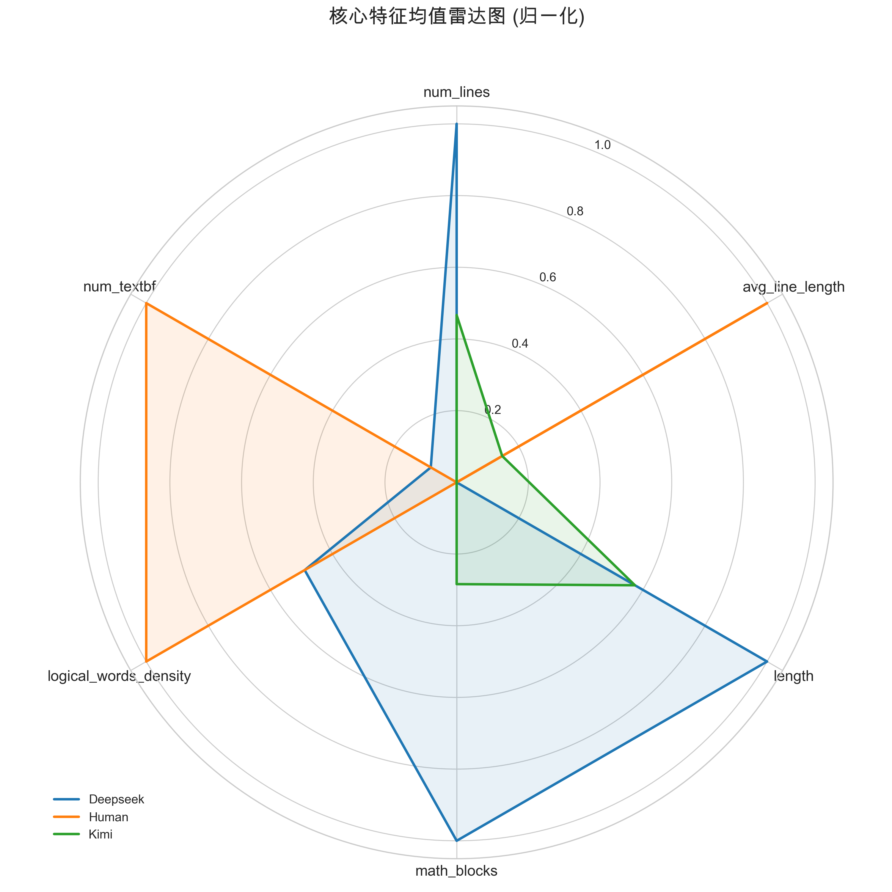
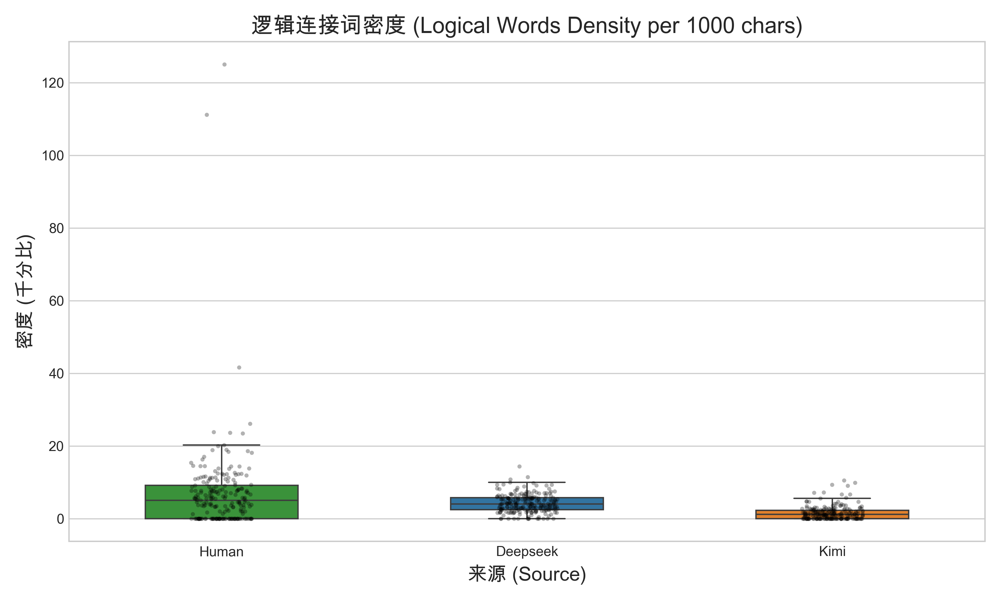

# 项目：基于文本与逻辑特征的数学作业来源判别 (Human vs Deepseek vs Kimi)

## 1. 项目背景与目标
随着大语言模型（LLM）的普及，利用 ChatGPT、Kimi、Deepseek 等工具辅助完成数学理论推导作业已成为常见现象。
本项目的核心目标是：**通过采集人类真实的数学作业解答，并利用不同大语言模型生成相同题目的解答，提取其风格、排版与逻辑特征，构建一个高精度的机器学习分类器，实现对解答来源（人类还是某种特定 AI）的精准判别。**

---

## 2. 项目目录结构

```text
Modelmid/
├── data/                   # 原始数据目录
│   ├── 近世代数群论部分题目及解答latex代码...  # 包含题目与人类标准解答的原始 LaTeX 文件
│   └── 数学分析习题.tex        # 《数学分析》微积分相关题目及解答
├── dataset/                # 处理后的结构化数据目录
│   └── full_dataset.csv    # 核心数据集 (id, course, content, human, deepseek, kimi)
├── docs/                   # 项目文档
│   └── data_standard.md    # 数据集字段定义与规范说明
├── models/                 # 训练好的机器学习模型
│   └── best_classifier_model.pkl  # 表现最好的组合特征 SVM 模型
├── scripts/                # 自动化处理与模型训练脚本
│   ├── process_data.py               # 提取原始数据、清洗并生成 CSV
│   ├── generate_deepseek_answers.py  # 并发调用 Deepseek API 补充解答
│   ├── generate_kimi_answers.py      # 并发调用 Kimi API 补充解答
│   ├── train_classifier.py           # 特征工程、模型训练与交叉验证
│   └── check_dist.py                 # 检查数据集标签分布
├── .env                    # 环境变量配置文件 (存放 API Keys)
├── experience.md           # 记录项目探索过程、踩坑经验与反思
└── README.md               # 项目主说明文档 (本文档)
```

---

## 3. 核心工作流与运行方式

整个项目分为三个主要阶段：数据处理、LLM 数据生成、特征工程与模型训练。所有脚本均放置在 `scripts/` 目录下，并在项目根目录下运行。

### 阶段一：数据清洗与结构化提取
我们编写了 `scripts/process_data.py` 脚本，从原始的 LaTeX 文件中智能提取题目和对应的人类解答。
**关键处理**：为了防止数据泄露（Data Leakage），脚本专门使用正则表达式剔除了人类解答中强烈的个人习惯排版前缀（如 `\textbf{证}`、`\textbf{解}`）。
- **运行命令**：
  ```bash
  python3 scripts/process_data.py
  ```
- **输出结果**：生成规范的 `dataset/full_dataset.csv` 文件，目前共提取了 219 道（174道代数 + 45道数分）题目及其纯净的人类解答。

### 阶段二：大语言模型数据生成 (多线程并发)
为了构建用于对比的负样本，我们编写了自动化生成脚本。脚本会读取 CSV 文件中空缺的 LLM 字段，将题干配合鲁棒的提示词，**通过多线程并发方式 (默认 5 个 worker)** 发送给对应的 API 进行批量解答，并将结果覆写回 CSV。
- **环境配置**：在根目录创建或编辑 `.env` 文件，填入你的 API 密钥：
  ```env
  DEEPSEEK_API_KEY="your_deepseek_key_here"
  MOONSHOT_API_KEY="your_kimi_key_here"
  ```
- **运行命令**：
  ```bash
  python3 scripts/generate_deepseek_answers.py
  python3 scripts/generate_kimi_answers.py
  ```

### 阶段三：模型训练与特征工程
在凑齐 Human (219条)、Deepseek (219条)、Kimi (219条) 的跨学科均衡三分类数据集（共657条）后，我们执行了多层次的特征提取和模型训练。
- **运行命令**：
  ```bash
  python3 scripts/train_classifier.py
  ```
- **输出结果**：在终端打印 5-fold 交叉验证的准确率、详细的分类报告以及随机森林分析出的特征重要性，并将最优模型固化保存至 `models/best_classifier_model.pkl`。

---

## 4. 模型设计与实验分析
在凑齐 Human (219条)、Deepseek (219条)、Kimi (219条) 的均衡三分类数据集后，我们执行了多层次的特征提取和模型训练。

您可以运行以下命令生成特征的可视化图表，结果将保存在 `docs/figures/` 中：
```bash
python3 scripts/visualize_features.py
```

### 4.1 领域特异性与防数据泄露特征工程
除了传统的 **TF-IDF** (词袋特征)，我们发现基于数学文本排版的**自定义结构特征**具有极其强大的区分度：
1. **基础排版特征**：回答总长度 (`length`)、行数 (`num_lines`)、平均每行长度 (`avg_line_length`)。
2. **公式特征**：行内和块级公式的总数 (`math_blocks`)、公式密度 (`math_density`)。
3. **特定 LaTeX 宏**：`\textbf`、`\frac`、`\sum` 等的使用频率。
4. **逻辑词频**：推理连词（如：因为、所以、显然、同理、从而、故等）的出现次数 (`logical_words_count`) 和密度 (`logical_words_density`)。

**TF-IDF 深度清洗与防作弊（Data Leakage Prevention）**：
我们在对 TF-IDF 的特征重要性进行深入排查时，发现了一些能让模型“走捷径”的作弊词（Tricky Features）。例如：
- LLMs 极度喜欢在最后加上 `\boxed{}` 来框住答案，或在推导中使用 `\quad` 空格。
- LLMs 喜欢用“综上所述”、“接下来”、“我们需要证明”等固定的机器套话。
为了逼迫模型去学习**真正底层的排版逻辑与数学思维差异**，而不是依赖这些表面的格式套话，我们在最终的模型流水线中（`train_classifier.py`）将这些特征作为 `stop_words` 进行了强行屏蔽。

### 4.2 实验结果 (三分类跨学科：Human vs Deepseek vs Kimi)
在彻底排除了人工标记的干扰并引入了《数学分析》这一新学科后，我们在跨学科三分类场景下使用 5-fold 交叉验证评估了模型：
- **最佳模型**：组合特征 (TF-IDF + 自定义排版/逻辑特征) + SVM 分类器。
- **整体准确率**：稳定达到 **95%** 的极高水准，这证明我们提取的“结构排版特征”和“逻辑词频特征”并没有过拟合某一本特定的书，而是真正抓住了人类与机器的行文泛化规律。
- **各类别 F1-score**：
  - Human：0.98
  - Deepseek：0.94
  - Kimi：0.94

### 4.3 核心特征洞察
通过随机森林提取的特征重要性，我们得出了以下关键结论：
1. **换行与长度控制差异 (`num_lines`, `length`, `avg_line_length`)**：人类解答通常分步较多、结构零散；而大模型往往倾向于大段输出，且在一行内连写的字数远超人类。
2. **逻辑词的行文签名 (`logical_words_density`)**：随着 Kimi 的加入，逻辑连接词特征在三分类中重要性激增！这说明人类、Deepseek 和 Kimi 在使用“因为”、“所以”、“显然”等词汇进行数学推理时，频率和密度有着非常独特的“行文指纹”。
3. **公式包裹习惯 (`math_blocks`)**：LLM 在输出中会比人类更频繁、更细致地使用 `$` 包裹哪怕是非常短小的数学符号。

### 4.4 可视化展示
下面是模型学到的几项关键特征在 Human、Deepseek 和 Kimi 之间的分布差异：

**行数 vs 平均行长散点分布**  
从下图中可以明显看出，人类（绿色）倾向于高频换行但每行字数极少；Kimi（橙色）和 Deepseek（蓝色）则更偏向于大段输出，但两者之间也有各自聚集的区域。  


**核心特征雷达图对比**  
雷达图展示了三类来源在结构与逻辑特征均值上的“行文指纹”。例如，Deepseek 的回答长度和公式数量显著最高，而 Kimi 则表现出最高密度的逻辑连接词。人类在多数机器特征上呈现“收敛”状态。  


**单项特征箱线图**  
以下是逻辑连接词密度的分布对比，可以看到虽然大家都会使用连词，但 LLM 的使用频率显著高于人类手写习惯：  


*(更多关于模型迭代、踩坑经历与数据清洗的细节，请参阅 [experience.md](experience.md))*

---

## 5. 后续规划 (TODO)
- **泛化性验证**：引入其他理科领域（如：常微分方程、概率论等）的数据，检验这些提取出的排版与逻辑特征是否依然稳健。
- **对抗生成网络 (GAN) 测试**：研究对抗判别器的潜在方法，即尝试通过高级的 Prompt 工程，强制要求大模型去刻意模仿人类的排版习惯和逻辑词频，观察当前分类器是否会被欺骗。