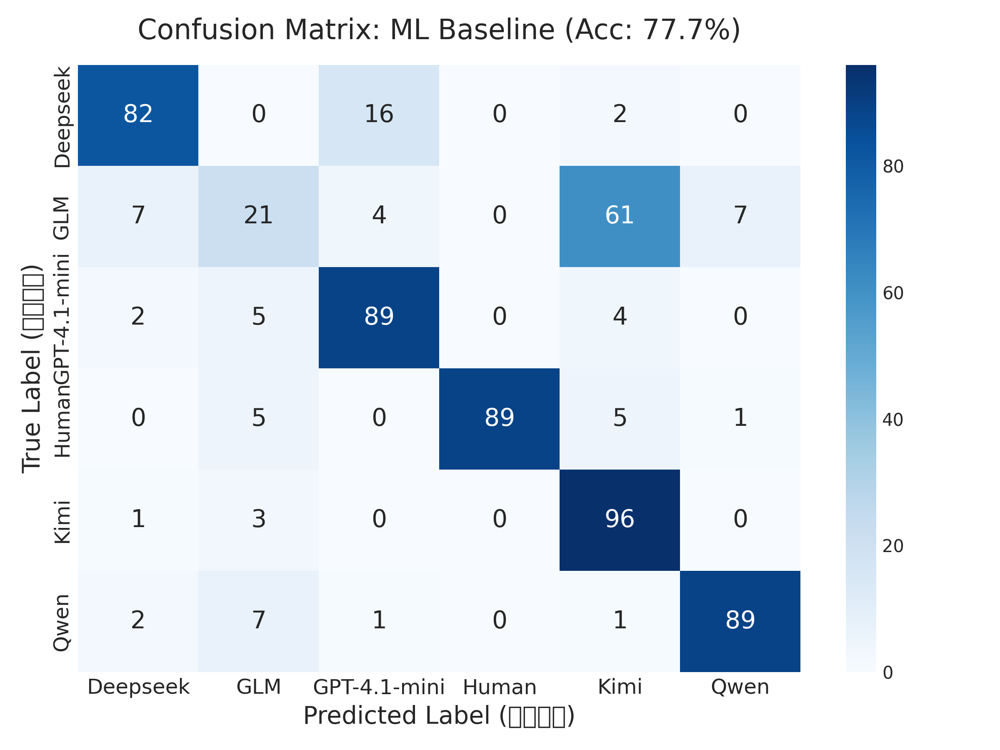
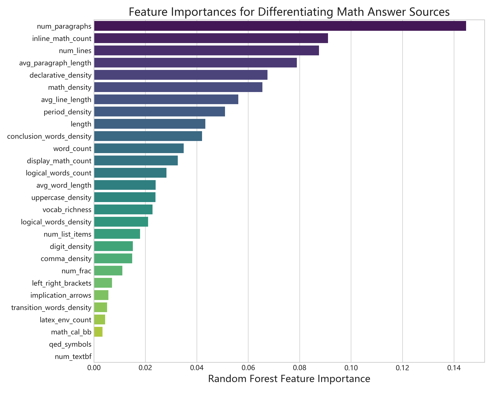
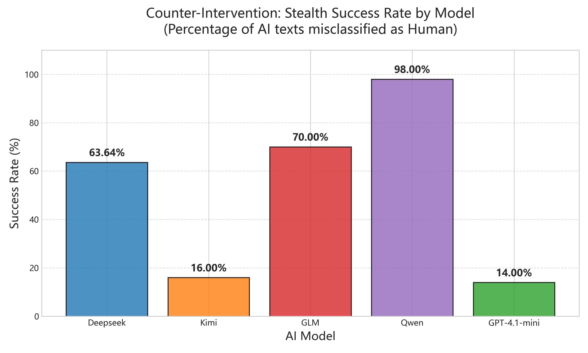

# Modelmid

**Mathematical Solution Origin Attribution**

Modelmid 研究数学解答文本的来源识别：给定同一道数学题的人类答案与多个大模型答案，判断一段解答更像来自 Human、DeepSeek、GLM、GPT-4.1-mini、Kimi 还是 Qwen。

项目关心的不是普通主题分类，而是数学证明写作中的来源风格指纹：LaTeX 习惯、公式密度、段落结构、逻辑推进方式、证明语气和词汇模式，都会在不同来源的解答中留下可学习的痕迹。


## 项目主线

1. 构建同题配对的多来源数学解答数据集。
2. 提取排版结构、LaTeX、逻辑词、段落形态和词汇模式等特征。
3. 比较可解释的传统 ML 检测器与端到端 DL / Transformer 检测器。
4. 观察跨题库、跨语言与防检测提示下的泛化边界。
5. 用可视化和特征重要性解释“模型味”来自哪里。

## 当前公开版结果

公开版保留了可复核的训练结果、特征图和对抗实验材料。核心结果入口包括：

- `results/classification/ml_vs_dl_comparison.csv`
- `results/classification/e2e_dl_results.csv`
- `results/classification/ablation_results.csv`
- `docs/experiment_report.md`
- `iterative_adversarial_experiment/reports/adversarial_experiment_report.md`
- `iterative_adversarial_experiment/reports/gpt41mini_adversarial_experiment_summary.md`

### 分类器对比

| Model | Type | Accuracy |
| --- | --- | ---: |
| RandomForest | ML | `0.977` |
| HistGradientBoosting | ML | `0.974` |
| ResNet_DNN | DL | `0.974` |
| Simple_MLP | DL | `0.970` |
| Conv1D_Net | DL | `0.965` |
| End-to-End DistilBERT | E2E Transformer | `0.981` |

传统 ML 检测器的优势是可解释、训练快；端到端 Transformer 检测器准确率更高，但解释成本也更高。



## 特征解释

项目提取了深度排版、结构和逻辑特征。根据 `docs/experiment_report.md`，当前特征维度为 28 个，覆盖：

- 段落数、平均段落长度、换行数
- 行内公式与块级公式使用频率
- LaTeX 环境数量
- 逻辑连接词与证明推进方式
- TF-IDF 与来源相关词汇模式
- PCA 空间中的来源聚类

一些有代表性的观察：

- 人类解答平均段落数更少，但单段信息密度更高。
- 不同模型对行内公式、块级公式和 LaTeX 环境有明显偏好差异。
- Qwen 等模型在某些数学符号包裹习惯上具有非常突出的风格信号。




## 对抗实验

项目还测试了大模型能否利用检测器反馈绕过分类器。对抗实验把 LLM 当作 prompt optimizer，让生成器根据判别器反馈逐轮调整写作策略。

公开版报告中保留了两类重要现象：

- 先验主导的 prompt 优化容易走向“伪人类写作”的幻觉，例如强行口语化、减少换行、破坏数学严谨性。
- 数据驱动的特征约束更有效；当优化器直接把特征偏差转成写作限制时，绕过率会快速上升。

GPT-4.1-mini 迭代对抗实验中，数据驱动 prompt 优化在第 5 轮达到 `100%` 绕过率：

| Round | Bypass Rate | Fooled as Human |
| --- | ---: | ---: |
| 1 | `0.00%` | `0 / 15` |
| 2 | `20.00%` | `3 / 15` |
| 3 | `46.67%` | `7 / 15` |
| 4 | `60.00%` | `9 / 15` |
| 5 | `100.00%` | `15 / 15` |



## 仓库结构

```text
Modelmid/
├── dataset/
│   ├── training/
│   ├── generalization/
│   └── adversarial/
├── docs/
│   ├── figures/
│   ├── reports/
│   └── experiment_report.md
├── iterative_adversarial_experiment/
│   ├── data/
│   ├── reports/
│   └── scripts/
├── results/
│   ├── adversarial/
│   ├── classification/
│   └── generalization/
├── scripts/
│   ├── data_generation/
│   ├── model_training/
│   └── visualization/
└── README.md
```

## 快速开始

安装依赖：

```bash
python3 -m venv .venv
source .venv/bin/activate
pip install -r requirements.txt
```

训练基础分类器：

```bash
python3 scripts/model_training/train_classifier.py
```

训练端到端 Transformer 检测器：

```bash
python3 scripts/model_training/train_e2e_transformer.py
```

运行防检测评估：

```bash
python3 scripts/model_training/evaluate_stealth.py
```

运行 GPT-4.1-mini 迭代对抗实验：

```bash
python3 iterative_adversarial_experiment/scripts/run_iterative_stealth_gpt41mini.py
```

## 公开版约束

公开仓库保留代码、数据、汇总结果和最终图表。大模型 checkpoint、逐轮缓存和旧版归档并不都适合继续扩张在主树中；如果需要完整研究现场，请以本地整理版为准。
